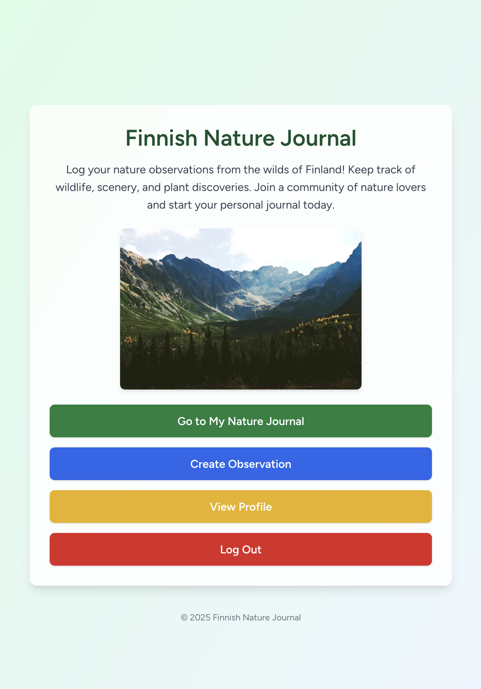

# FinnishNatureJournal

A web application for exploring and documenting observations of Finnish nature, built with Laravel and Inertia.js. This project allows users to log and view entries about flora, fauna, and natural phenomena, designed as an educational tool for students to engage with Finland's natural environment.



## Table of Contents
- [Prerequisites](#prerequisites)
- [Installation](#installation)
- [Running the Application](#running-the-application)
- [Project Structure](#project-structure)
- [Troubleshooting](#troubleshooting)
- [Contributing](#contributing)
- [License](#license)

## Prerequisites

Before you begin, ensure you have the following installed on your computer:
- **PHP** (version 8.1 or higher): Download from [php.net](https://www.php.net/downloads).
- **Composer**: Dependency manager for PHP. Install from [getcomposer.org](https://getcomposer.org/).
- **Node.js** (version 16 or higher) and **npm**: Required for Inertia.js frontend assets. Download from [nodejs.org](https://nodejs.org/).
- **Git**: To clone the repository. Install from [git-scm.com](https://git-scm.com/).
- **Database**: A database like MySQL, PostgreSQL, or SQLite. MySQL is recommended (e.g., via [XAMPP](https://www.apachefriends.org/) or [MySQL Community Server](https://dev.mysql.com/downloads/)).
- A code editor like [Visual Studio Code](https://code.visualstudio.com/) (recommended).

Verify installations by running these commands in your terminal:
```bash
php --version
composer --version
node --version
npm --version
git --version
```

## Installation

Follow these steps to set up the project locally:

1. **Clone the Repository**  
   Open your terminal and run:
   ```bash
   git clone https://github.com/kalwar/FinnishNatureJournal.git
   ```

2. **Navigate to the Project Directory**  
   Change to the project folder:
   ```bash
   cd FinnishNatureJournal
   ```

3. **Install PHP Dependencies**  
   Install Laravel's dependencies using Composer:
   ```bash
   composer install
   ```
   **Note**: This requires an internet connection and may take a few minutes.

4. **Install JavaScript Dependencies**  
   Install frontend dependencies for Inertia.js and Vue.js:
   ```bash
   npm install
   ```

5. **Set Up Environment File**  
   Copy the `.env.example` file to create a `.env` file:
   ```bash
   cp .env.example .env
   ```

6. **Generate Application Key**  
   Run the following command to generate a unique app key:
   ```bash
   php artisan key:generate
   ```

7. **Configure Database**  
   - Open the `.env` file in a text editor.
   - Update the database settings to match your setup (e.g., MySQL, SQLite):
     ```env
     DB_CONNECTION=mysql
     DB_HOST=127.0.0.1
     DB_PORT=3306
     DB_DATABASE=finnish_nature_journal
     DB_USERNAME=your_username
     DB_PASSWORD=your_password
     ```
   - If using MySQL, create a database named `finnish_nature_journal` in your database management tool (e.g., phpMyAdmin or MySQL CLI).
   - For SQLite, create an empty `database/database.sqlite` file and set `DB_CONNECTION=sqlite` in `.env`.

8. **Run Database Migrations**  
   Set up the database tables:
   ```bash
   php artisan migrate
   ```

9. **Build Frontend Assets**  
   Compile the Inertia.js/Vue.js assets:
   ```bash
   npm run build
   ```

## Running the Application

Once the setup is complete, you can run the application locally:

1. **Start the Laravel Development Server**  
   Run the following command:
   ```bash
   php artisan serve
   ```
   This starts the server at `http://localhost:8000`. If it doesn't open automatically, visit that URL in your browser.

2. **Explore the App**  
   - Browse existing nature journal entries.
   - Add new observations (e.g., plants, animals, or weather phenomena).
   - Use the interface to filter or search entries (if applicable).

3. **Stopping the Server**  
   To stop the server, press `Ctrl + C` in the terminal.

## Project Structure

Here's a brief overview of the project folders and files:
- **`app/`**: Contains Laravel application logic (e.g., models, controllers).
- **`resources/`**: Frontend assets and views.
  - `js/`: React.js components and Inertia.js pages.
  - `css/`: Stylesheets (e.g., Tailwind CSS etc).
- **`routes/`**: Defines web routes for the application.
- **`database/`**: Migrations and seeders for the database.
- **`public/`**: Static assets like images or compiled CSS/JS.
- **`.env.example`**: Environment variables (e.g., database settings). 
- **`package.json`**: Lists frontend dependencies and scripts.
- **`composer.json`**: Lists PHP dependencies.

## Troubleshooting

- **Error: "php: command not found"**  
  Ensure PHP is installed and added to your system's PATH. Reinstall PHP if needed.

- **Error: "SQLSTATE[HY000] [2002] Connection refused"**  
  - Check that your database server (e.g., MySQL) is running.
  - Verify the `.env` database settings (host, port, username, password).
  - Ensure the database `finnish_nature_journal` exists.

- **Error: "Port 8000 is already in use"**  
  Another application is using port 8000. Stop the other process or run:
  ```bash
  php artisan serve --port=8001
  ```

- **Frontend assets not loading**  
  - Re-run `npm install` and `npm run build`.
  - Clear your browser cache or try a different browser.

- **Inertia.js errors**  
  Ensure `npm run build` was successful and the Laravel server is running.

For additional help, contact your instructor or open an issue on the [GitHub repository](https://github.com/kalwar/FinnishNatureJournal/issues).

## Contributing

Students are welcome to contribute by adding features, fixing bugs, or improving documentation:
1. Fork the repository.
2. Create a new branch (`git checkout -b feature/your-feature`).
3. Make your changes and commit (`git commit -m "Add your feature"`).
4. Push to your branch (`git push origin feature/your-feature`).
5. Open a pull request on GitHub.

Please follow the [Contributor Covenant Code of Conduct](https://www.contributor-covenant.org/).

## License

This project is licensed under the MIT License. See the [LICENSE](LICENSE) file for details.
